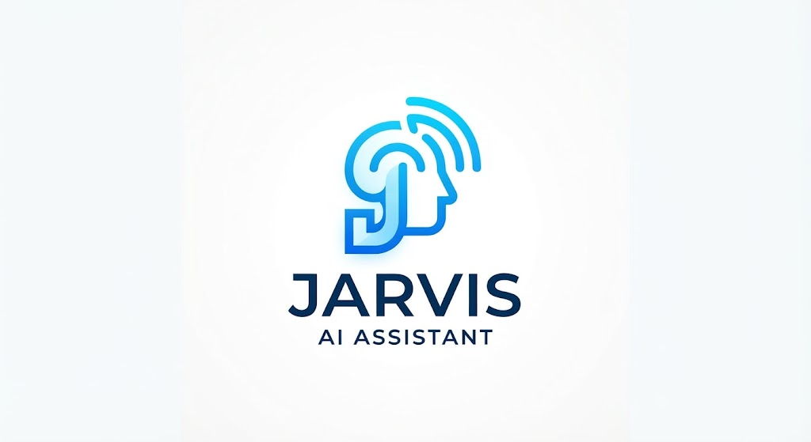

<p align="center"></p>

# J.A.R.V.I.S. · Asistente personal por voz

> *"Buenas noches, señor. Todos los sistemas en línea."*

Asistente de inteligencia artificial inspirado en el JARVIS de Iron Man. Vive en tu PC, escucha en segundo plano y se activa cuando dices **"Hey Jarvis"**. Contesta cualquier pregunta por voz, busca en internet, consulta el clima, pone temporizadores, abre aplicaciones y se acuerda de ti entre sesiones.

Habla **español latino** e **inglés** (como en la versión original de la película), y puedes cambiar de idioma en plena conversación. **Se puede usar gratis** con Groq, Gemini u Ollama.


---

## Características

- **Activación por voz**: detecta "Hey Jarvis" en local, sin enviar audio a internet mientras espera.
- **Conversación natural**: después de responder sigue escuchando unos segundos, así que puedes seguir hablando sin volver a llamarle.
- **Varios cerebros**: Groq y Gemini (gratis), Claude (de pago, el más listo) y Ollama (local, sin internet). Si uno falla o se queda sin cupo, pasa al siguiente.
- **Bilingüe**: español latino con trato de usted, o inglés con modales británicos. Se cambia con *"Jarvis, habla en inglés"* / *"Jarvis, speak Spanish"*.
- **Búsqueda en internet gratuita**: noticias, resultados, precios y cualquier dato actual, con cualquier cerebro.
- **Memoria a largo plazo**: recuerda tus gustos, nombres y rutinas entre sesiones.
- **Herramientas**: clima, temporizadores con aviso por voz, abrir aplicaciones y búsquedas en Google o YouTube.
- **Control de la tele**: enciende, apaga, cambia el volumen, los canales y la entrada, y abre apps (YouTube, Netflix...) en teles Samsung smart.
- **Respaldo sin internet**: si falla la voz online, usa la voz de Windows; si no hay internet, usa el modelo local.

## Cómo funciona

```
🎤 Micrófono (siempre escuchando)
   │
   ▼
1. Activación ── openWakeWord detecta "Hey Jarvis" (local)
   │                 🔔 pitido: "te escucho"
   ▼
2. Oído ──────── faster-whisper convierte tu voz en texto (local)
   │
   ▼
3. Cerebro ───── Claude ─► Gemini ─► Groq ─► Ollama   (el primero que responda)
   │                 └─ herramientas: búsqueda web, clima, temporizadores, memoria...
   ▼
4. Voz ───────── Edge TTS ──► si falla ──► voz de Windows
   │
   ▼
🔊 Altavoz
```

| Pieza | Tecnología | Dónde se ejecuta |
|---|---|---|
| Palabra de activación | [openWakeWord](https://github.com/dscripka/openWakeWord) | Local |
| Voz a texto | [faster-whisper](https://github.com/SYSTRAN/faster-whisper) | Local |
| Cerebro | [Groq](https://groq.com), [Gemini](https://ai.google.dev), [Claude](https://www.anthropic.com/claude), [Ollama](https://ollama.com) | Nube o local |
| Búsqueda web | [DuckDuckGo](https://github.com/deedy5/ddgs) (o la de Claude) | Nube |
| Texto a voz | [edge-tts](https://github.com/rany2/edge-tts) + Windows SAPI | Nube + local |

## Cerebros disponibles

| Cerebro | Precio | Ventaja | Dónde sacar la clave |
|---|---|---|---|
| **Gemini** | Gratis (con límites diarios) | Rápido y muy bueno en español | [aistudio.google.com/apikey](https://aistudio.google.com/apikey) |
| **Groq** | Gratis (~50–70 preguntas/día) | Muy rápido si no hablas seguido; buen respaldo | [console.groq.com/keys](https://console.groq.com/keys) |
| **Claude** | De pago (~1 centavo por pregunta) | El más inteligente | [platform.claude.com](https://platform.claude.com/settings/keys) |
| **Ollama** | Gratis | Funciona sin internet y es privado | No necesita clave |

Sólo se usan los cerebros que tengan clave. El orden se cambia con `JARVIS_CEREBROS`. Con una sola clave gratuita (Groq o Gemini) Jarvis ya funciona.

> En los planes gratuitos, el proveedor puede usar tus conversaciones para mejorar sus modelos. Si te importa la privacidad, usa Ollama o Claude.

## Requisitos

- Windows 10 u 11
- Python 3.11 o superior
- Micrófono y altavoces
- Al menos un cerebro: una clave gratuita de Groq o Gemini, la de Claude, u Ollama instalado

## Instalación

```powershell
git clone https://github.com/Pabl0sk1/jarvis-ai.git
cd jarvis-ai

python -m venv .venv
.\.venv\Scripts\python.exe -m pip install -r requirements.txt

copy .env.example .env
```

Abre `.env` y pega al menos una clave (`GROQ_API_KEY`, `GEMINI_API_KEY` o `ANTHROPIC_API_KEY`). Aprovecha para poner tu nombre, tu ciudad y el idioma inicial.

**Cerebro local (opcional, sin internet):**

```powershell
winget install Ollama.Ollama
ollama pull qwen2.5:3b
```

## Uso

```powershell
iniciar_jarvis.bat                   # modo voz: di "Hey Jarvis" y habla
iniciar_jarvis.bat --idioma en       # arrancar en inglés
iniciar_jarvis.bat --texto           # chatear por teclado (sin micrófono)
iniciar_jarvis.bat --texto --hablar  # por teclado, pero responde en voz alta
iniciar_jarvis.bat --probar-voces    # escuchar las voces para elegir la tuya
iniciar_jarvis.bat --debug           # ver qué herramientas usa y los errores
iniciar_jarvis.bat --buscar-dispositivos  # buscar la tele en la red de casa
iniciar_jarvis.bat --emparejar-tele       # dar permiso a Jarvis en la tele (una sola vez)
```

### Tele Samsung

1. El PC tiene que estar en la **misma red** que la tele.
2. En la tele, activa el encendido remoto: *Configuración → General → Red → Conexión con el móvil* (el nombre cambia según el modelo).
3. Ejecuta `iniciar_jarvis.bat --buscar-dispositivos` y copia la IP y la MAC de la tele en `JARVIS_TELE_IP` y `JARVIS_TELE_MAC`.
4. Con la tele encendida, ejecuta `iniciar_jarvis.bat --emparejar-tele` y elige **Permitir** en el aviso de la tele.

Conviene reservar la IP de la tele en el router para que no cambie.

**TV box conectado por HDMI:** si activas **Anynet+ (HDMI-CEC)** en la tele (*Configuración → General → Administrador de dispositivos externos*) y **HDMI-CEC** en el box, cuando la tele esté en la entrada del box, las flechas, OK, volver y reproducir/pausa que envía Jarvis le llegan al box.

Al arrancar muestra qué cerebros va a usar y en qué orden. La primera vez descarga los modelos de voz y de activación (unos 500 MB), así que tarda un poco más.

### Ejemplos

| Tú dices | Jarvis |
|---|---|
| "Hey Jarvis, ¿qué tiempo va a hacer mañana?" | Consulta la previsión de tu ciudad |
| "Pon un temporizador de 10 minutos para sacar la pizza" | Te avisa por voz cuando termine |
| "¿Quién ganó el partido de anoche?" | Lo busca en internet |
| "Acuérdate de que mi color favorito es el azul" | Lo guarda en su memoria |
| "Pon música de AC/DC en YouTube" | Abre la búsqueda en el navegador |
| "Abre la calculadora" | Abre la aplicación |
| "Enciende la tele y pon YouTube" | Enciende la tele por red y abre YouTube |
| "Sube un poco el volumen de la tele" | Pulsa varias veces subir volumen |
| "Pon la tele en la TV box" | Cambia la tele a la entrada HDMI |
| "Jarvis, habla en inglés" | *"Of course, sir."* A partir de ahí, todo en inglés |
| "Eso es todo" | *"Aquí estaré, señor."* y vuelve a esperar |

## App para el celular (Android)

La carpeta [`android/`](android) contiene Jarvis para el celular, para llevarlo a todas partes y usarlo en el auto:

- Escucha **"Hey Jarvis"** siempre, en segundo plano (mismo modelo de openWakeWord que el PC, con ONNX Runtime).
- Entiende tu voz con el reconocedor de Google y responde con la **misma voz** que el PC (Edge TTS), o con la voz de Google si no hay internet.
- Usa los mismos cerebros gratuitos (Gemini y Groq) y lee las claves del mismo `.env`.
- Herramientas: búsqueda web, clima, temporizadores, memoria, abrir apps, **navegar con Google Maps**, **poner y controlar la música**, batería e idioma.
- **Modo auto**: al conectarse por Bluetooth a la radio (`JARVIS_RADIO_AUTO`), te da la bienvenida, habla por los parlantes y responde más corto.

**Compilar, instalar y actualizar** (necesita el SDK de Android y Java 17 o superior). Con el celular conectado por USB y la depuración USB activada:

```powershell
actualizar_app.bat      # compila, espera al celular e instala SIN borrar los datos de la app
respaldar_memoria.bat   # copia la memoria de Jarvis del celular a datos\memoria_celular.json
restaurar_memoria.bat   # la devuelve al celular (p. ej. después de reinstalar)
```

- **Actualizar no borra nada**: la memoria, los permisos y los ajustes se conservan, siempre que la app se firme con la **misma clave**.
- **Clave de firma propia**: `android/firma.properties` indica dónde está la clave (`storeFile`) y su contraseña. **Nunca se sube a git.** Guarda una copia de los dos archivos fuera del PC: sin ellos no podrás actualizar la app y habría que reinstalarla. Para crear una clave nueva: `keytool -genkeypair -keystore jarvis-firma.jks -storetype PKCS12 -alias jarvis -keyalg RSA -keysize 2048 -validity 36500`.
- **Desinstalar sí borra la memoria**: haz antes `respaldar_memoria.bat`.
- **Logo e iconos**: `.venv\Scripts\python.exe android\generar_iconos.py` recorta el dibujo de `docs/logo_completo.png` y genera `docs/logo.svg`, `docs/logo_transparente.png` (sin fondo), `docs/logo_fondo_blanco.png` y todos los iconos de la app (escritorio con fondo blanco, monocromo para temas y notificación).

En Xiaomi/HyperOS, dale a la app batería sin restricciones, "Mostrar sobre otras apps" e "Inicio automático"; si no, el sistema la cierra. Además, HyperOS pide confirmar en el celular cada instalación por USB.

> Las claves de API quedan dentro del APK: es una app personal, no la compartas.

## Configuración

Todo se configura en el archivo `.env` (ver [`.env.example`](.env.example)):

| Variable | Por defecto | Descripción |
|---|---|---|
| `JARVIS_CEREBROS` | `claude,gemini,groq,local` | Orden en que se prueban los cerebros |
| `GEMINI_API_KEY` / `JARVIS_MODELO_GEMINI` | — / `gemini-3.1-flash-lite` | Gemini (gratis) |
| `GROQ_API_KEY` / `JARVIS_MODELO_GROQ` | — / `openai/gpt-oss-120b` | Groq (gratis) |
| `ANTHROPIC_API_KEY` / `JARVIS_MODELO_CLAUDE` | — / `claude-sonnet-5` | Claude (de pago) |
| `JARVIS_BUSQUEDA_WEB_CLAUDE` | `no` | Búsqueda propia de Claude (0,01 USD por búsqueda) en vez de la gratuita |
| `JARVIS_MODELO_LOCAL` | `qwen2.5:3b` | Modelo de Ollama |
| `JARVIS_NOMBRE_USUARIO` | — | Cómo te llamas |
| `JARVIS_CIUDAD` | `Asunción` | Ciudad para el clima y las búsquedas |
| `JARVIS_IDIOMA` | `es` | Idioma al arrancar: `es` o `en` |
| `JARVIS_VOZ_ES` / `JARVIS_VOZ_EN` | `es-MX-JorgeNeural` / `en-GB-RyanNeural` | Voz de cada idioma |
| `JARVIS_TONO_ES` / `JARVIS_TONO_EN` | `-4Hz` / `-2Hz` | Más negativo = voz más grave |
| `JARVIS_TRATAMIENTO_ES` / `_EN` | `señor` / `sir` | Cómo te llama Jarvis |
| `JARVIS_TELE_IP` / `JARVIS_TELE_MAC` | — | Tele Samsung a controlar; vacío = sin tele |
| `JARVIS_MICROFONO` | — | Micrófono a usar (número o parte del nombre); vacío = el de Windows |
| `JARVIS_UMBRAL_ACTIVACION` | `0.5` | Sensibilidad de "Hey Jarvis" |
| `JARVIS_MODELO_WHISPER` | `small` | `tiny`, `base`, `small` o `medium` |
| `JARVIS_SEGUNDOS_SEGUIMIENTO` | `6` | Segundos que sigue escuchando tras responder |

## Estructura del proyecto

```
jarvis-ai/
├── jarvis/
│   ├── __main__.py      # arranque y bucle de conversación
│   ├── config.py        # lectura del archivo .env
│   ├── idioma.py        # español latino / inglés, cambio en caliente
│   ├── personalidad.py  # quién es Jarvis y cómo habla
│   ├── cerebro.py       # Claude, Groq, Gemini y Ollama, con respaldo entre ellos
│   ├── herramientas.py  # búsqueda web, clima, temporizadores, apps, memoria...
│   ├── tele.py          # control de teles Samsung por la red
│   ├── red.py           # búsqueda de dispositivos en la red de casa
│   ├── memoria.py       # memoria a largo plazo (datos/memoria.json)
│   ├── audio.py         # micrófono y detección de silencio
│   ├── activacion.py    # "Hey Jarvis" con openWakeWord
│   ├── transcripcion.py # voz a texto con faster-whisper
│   └── voz.py           # texto a voz con Edge TTS / Windows
├── android/             # app de Jarvis para el celular (Kotlin)
├── .env.example
├── iniciar_jarvis.bat
├── requirements.txt
└── LICENSE
```

## Añadir una herramienta nueva

Las herramientas están en [`jarvis/herramientas.py`](jarvis/herramientas.py). Para añadir una:

1. Escribe un método que devuelva un `str` con el resultado.
2. Regístralo en `self._lista` con un `Herramienta(nombre, descripción, parámetros, función)`.

Todos los cerebros la descubren solos y la usan cuando haga falta.

## Solución de problemas

| Problema | Solución |
|---|---|
| No te oye en absoluto | Revisa que el micrófono no esté silenciado (tecla de silencio del portátil o *Configuración → Sistema → Sonido → Entrada*) y que el volumen de entrada no esté a 0 |
| No se activa al decir "Hey Jarvis" | Baja `JARVIS_UMBRAL_ACTIVACION` a `0.3`–`0.4` y habla claro, cerca del micrófono |
| Se activa solo | Sube `JARVIS_UMBRAL_ACTIVACION` a `0.6`–`0.7` |
| Tarda mucho en entenderte | Usa `JARVIS_MODELO_WHISPER=base` |
| Te entiende mal | Usa `JARVIS_MODELO_WHISPER=medium` (más lento) |
| "No tengo ningún cerebro disponible" | Revisa las claves del `.env`, tu conexión o que Ollama esté abierto. Con `--debug` verás por qué falla cada uno |
| Un cerebro gratuito deja de responder | Has llegado al límite diario; Jarvis pasa solo al siguiente cerebro |
| Groq tarda 10–20 segundos | Has superado su límite por minuto (8.000 tokens); espera un poco o usa Gemini primero |
| Se escucha a sí mismo | Baja el volumen de los altavoces o usa auriculares |
| No encuentra la tele | El PC y la tele tienen que estar en la misma red (mismo router) y la tele encendida |
| La tele no se enciende por voz | Activa el encendido remoto en la tele y pon `JARVIS_TELE_MAC`; funciona mejor con la tele conectada por cable |

## Hoja de ruta

- [x] Activación por voz, conversación y respuestas habladas
- [x] Varios cerebros (Groq, Gemini, Claude, Ollama) con respaldo automático
- [x] Español latino e inglés con cambio en caliente
- [x] Memoria a largo plazo, búsqueda web gratuita y herramientas básicas
- [ ] Modelo de activación propio con sólo "Jarvis"
- [ ] Arranque automático con Windows, en segundo plano
- [ ] Interrumpirle mientras habla
- [ ] Control del PC: volumen, música, apagar, archivos
- [x] Control de teles Samsung smart por la red
- [ ] Control de la TV box Android (ADB por red)
- [ ] Aire acondicionado por infrarrojo
- [ ] Domótica: luces y enchufes (Home Assistant)
- [ ] App para el celular con modo auto (código escrito, falta compilarla y probarla)
- [ ] Versión portátil: Raspberry Pi 5 en la mochila
- [ ] Integración con el auto
- [ ] Interfaz visual estilo holograma

## Créditos

- Inspirado en J.A.R.V.I.S. de *Iron Man* (Marvel Studios). Este proyecto no está afiliado a Marvel ni a Disney. Las voces son sintéticas y sólo se parecen en estilo a la de la película.
- Ideas tomadas de [OpenClaw](https://openclaw.ai): memoria persistente, herramientas ampliables y "skills".
- Los modelos preentrenados de openWakeWord (incluido "hey jarvis", copiado en `android/app/src/main/assets`) tienen licencia CC BY-NC-SA 4.0: sólo para uso no comercial.
- Construido con [openWakeWord](https://github.com/dscripka/openWakeWord), [faster-whisper](https://github.com/SYSTRAN/faster-whisper), [edge-tts](https://github.com/rany2/edge-tts), [ddgs](https://github.com/deedy5/ddgs), [Groq](https://groq.com), [Gemini](https://ai.google.dev), [Claude](https://www.anthropic.com/claude) y [Ollama](https://ollama.com).

## Licencia

[MIT](LICENSE) © 2026 Pabl0sk1
